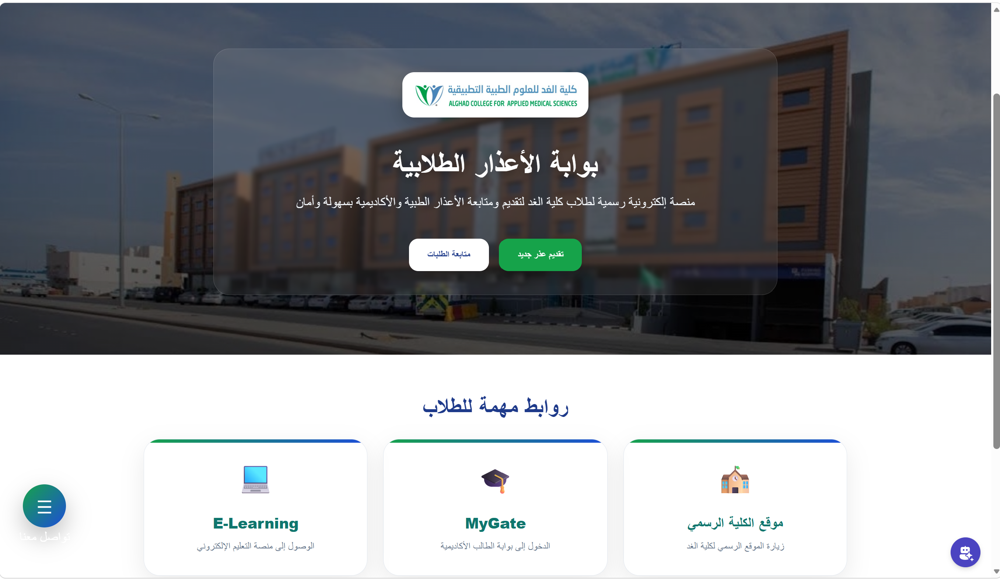
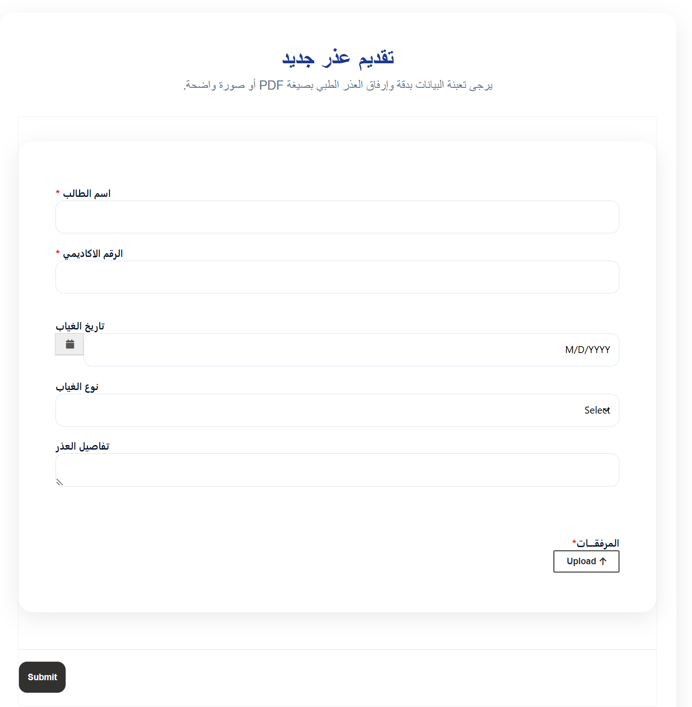
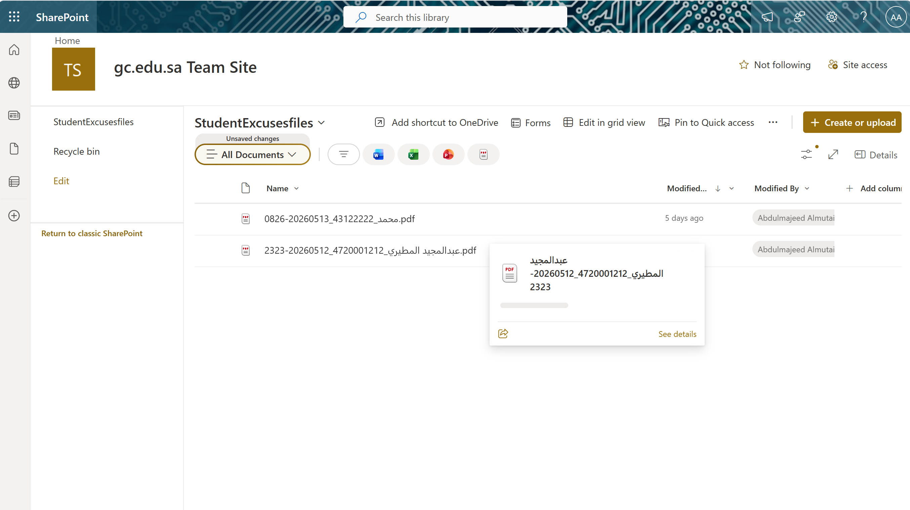
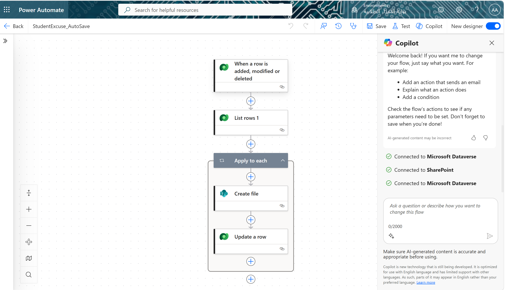

# Student Excuse Portal

A student excuse management portal built using Microsoft Power Platform.

## Technologies
- Power Pages
- Power Automate
- Dataverse
- SharePoint
- HTML
- CSS
- JavaScript

## Features
- Upload medical excuses
- Store attachments in SharePoint
- Student request tracking
- Details page with Query String
- Table permissions
- Automated workflows

## Screenshots
(Home page)
(Request page)
(Details page)

## Status
In development

## Project Screenshots

### Home Page

### Requests Page

### Details Page

### Power Automate Workflow

### SharePoint Storage

